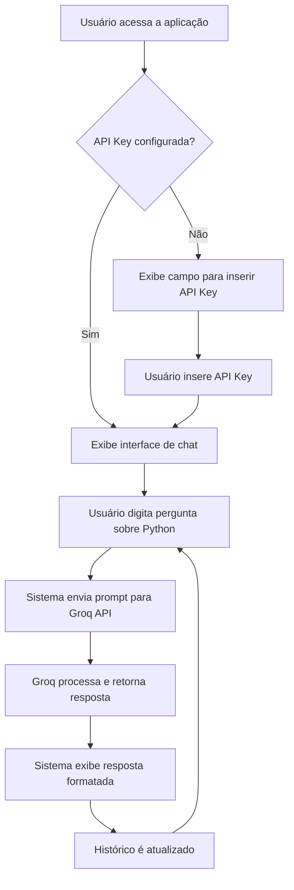

# 🧑‍💻 Estudo de Caso 1 - DSA AI Coder  
**Criando Seu Assistente de Programação Python, em Python**  

Bem-vindo ao **DSA AI Coder**, um assistente de programação em Python construído com **Streamlit** e integrado a **modelos de linguagem Groq**.  
O projeto foi desenvolvido como parte da formação da **Data Science Academy (DSA)** e tem como objetivo apoiar desenvolvedores — especialmente iniciantes — no aprendizado de **Python**, oferecendo respostas claras, exemplos práticos e um fluxo de interação simples e intuitivo.  


---

## 🎬 Demonstração Interativa


## 🚀 Objetivo do Projeto
O **DSA AI Coder** é uma aplicação prática, acessível e didática que:  
- Responde perguntas sobre **código, algoritmos, bibliotecas e boas práticas em Python**.  
- Fornece exemplos práticos para facilitar o aprendizado.  
- Demonstra boas práticas de **design de sistemas com IA**, como:  
  - Uso de prompts bem projetados.  
  - Tratamento de erros.  
  - Manutenção de histórico de conversas para garantir contexto contínuo.  
- Integra recursos visuais no **Streamlit**, incluindo:  
  - Campos de entrada de chave de API.  
  - Menus interativos.  
  - Links úteis para suporte e cursos da **DSA**.  

---

## 🛠️ Tecnologias Utilizadas
- [Python 3.13](https://www.python.org/)  
- [Conda](https://docs.conda.io/)  
- [Streamlit](https://streamlit.io/)  
- [Groq LLM](https://groq.com/)  
- Outras bibliotecas listadas no [`requirements.txt`](./requirements.txt)  

---

## 📦 Instalação e Execução

### 1. Clone este repositório:
```bash
git clone https://github.com/seu-usuario/dsa-ai-coder.git
cd dsa-ai-coder
```

### 2. Crie e ative um ambiente virtual:
```bash
conda create --name dsaec1 python=3.13
conda activate dsaec1
# ou no Linux/MacOS:
source activate dsaec1
```

### 3. Instale as dependências:
```bash
conda install pip
pip install -r requirements.txt
```

### 4. Execute a aplicação:
```bash
streamlit run dsa_assistente.py
```

## 🔄 Fluxo da Aplicação



## 💡 Exemplos de Uso

Após iniciar a aplicação, você pode interagir com o assistente enviando perguntas como:

- `Como crio um hello world em Python?`
- `Qual a sintaxe de um loop em Python?`
- `Como eu uso a função map em Python? Me dê um exemplo com lambda.`

O assistente responderá com explicações claras, didáticas e exemplos práticos.

### Exemplo de Resposta:
```python
# Como usar a função map com lambda em Python
numeros = [1, 2, 3, 4, 5]
quadrados = map(lambda x: x ** 2, numeros)
print(list(quadrados))  # Output: [1, 4, 9, 16, 25]
```

## 🧹 Gerenciamento do Ambiente Virtual

Para desativar o ambiente virtual:
```bash
conda deactivate
```

Para remover completamente o ambiente:
```bash
conda remove --name dsaec1 --all
```

## 🏗️ Arquitetura do Projeto

```
dsa-ai-coder/
│
├── dsa_assistente.py     # Aplicação principal Streamlit
├── requirements.txt      # Dependências do projeto
├── README.md            # Este arquivo
```

## 🎯 Diferenciais do Projeto

✅ **Foco em educação prática** para programadores iniciantes.  
✅ **Integração com IA de ponta** (Groq LLM) para respostas de alta qualidade.  
✅ **Interface interativa e intuitiva** via Streamlit com histórico de conversas.  
✅ **Estrutura modular e bem documentada** para fácil manutenção e expansão.  
✅ **Demonstração de boas práticas** de desenvolvimento com IA e tratamento de erros.  

## 📚 Recursos Adicionais

- [Data Science Academy](https://www.datascienceacademy.com.br)
- [Documentação do Streamlit](https://docs.streamlit.io/)
- [Groq AI Platform](https://groq.com/)
- [Documentação Python](https://docs.python.org/3/)

## 🤝 Contribuição

Contribuições são sempre bem-vindas!  
Se quiser colaborar:

1. Faça um fork do projeto
2. Crie uma branch para sua feature ou correção:
```bash
git checkout -b minha-feature
```
3. Faça o commit das alterações:
```bash
git commit -m 'Minha nova feature'
```
4. Envie para a branch principal:
```bash
git push origin minha-feature
```
5. Abra um Pull Request

## 👤 Autor

**Beatriz Chieffi Failla D'Addea**  
- 💼 [LinkedIn](https://www.linkedin.com/in/beatriz-daddea/)  
- 💻 [GitHub](https://github.com/seu-usuario)  

---

✨ **Projeto desenvolvido como parte do Estudo de Caso 1 da Data Science Academy.**